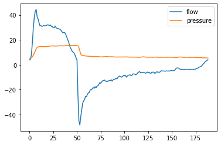
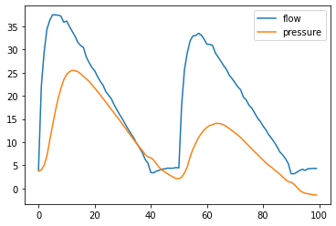
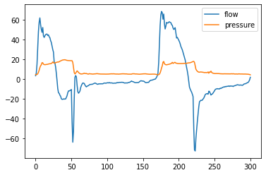

# Modelling-Patient-Ventilator-Asynchrony
As healthcare development increasingly depends on clinical decision support systems (CDSS) to digitize high volume of breathing waveform data from ventilators, more and more advanced techniques have been applied in optimizing anomaly detection in the early stage of the respiratory diseases for patients in the intensive care unit (ICU). It would be no exaggeration to say that CDSS are widely applied in the area of ventilators for detecting patient-ventilator asynchrony (PVA). PVA is defined as a mismatch between inspiratory as well as expiratory processes of patients and ventilators regarding flow and pressure supply.

## Table of Contents
1. [Waveform_data](##Waveform_data)
2. [Methodologies](##Methodologies)

### Waveform_data
Ventilators display streaming waveform data to show health conditions of a patient. Ventilator waveforms describe a visual human machine interaction between the patient and the ventilator about breathing information. It is the most direct and common way to detect asynchronous data that are used by clinicians to diagnose and treat patients in real time. A normal waveform data mainly contains flow and pressure versus time scalars in Fig 1:

In our study, breath metadata come from 5 distinctive patients who received consecutive ventilation in ICU at University of California Davis Medical Center. Each row of metadata represents an intact breath, containing 16 columns of clinically relevant data such as breath number (BN), tidal volume inhaled (TVi), tidal volume exhaled (TVe) and so on. The main breath metadata are shown as follows:
| Name | Units | Description |
| ------------- | ------------- | ------------- |
| TVi | ml | Amount of air breathed in |
| TVe	| ml | Amount of air breathed out |
| TVe/TVi ratio |	N/A |	Ratio of TVi/TVe |
| I-time | seconds | Inspiratory time |
| E-time | seconds | Expiratory time |
| I:E ratio	| N/A	| Ratio of I-time/E-time |

Raw ventilator data needs to be formatted in an expected way so that our software is able to understand and read it. With the help of a python library called ventmap, an open-source multi-purpose ventilator analytic was developed for processing ventilator waveform data, raw breath metadata can be turned into a 2-column waveform PB-840 (Puritan Bennett 840, Covidien, U.S.) format.

There are two principal types of PVA considering the prevalence of occurrence in clinical experience presented in Fig 2(a): double triggering asynchrony (DTA) and Fig 2(b): breath stacking asynchrony (BSA). Both of them have the same characteristics of incomplete process of exhalation, a phenomenon called dynamic hyperinflation due to inadequate expiration time that would have a detrimental impact on the lungs.

In detail, during the first breath in DTA, the inspiratory effort lingers beyond that produced by the ventilator. It will subsequently trigger next breath without the intervention of exhalation, resulting in dynamic hyperinflation and potential lung damage. DTA refers to a sequence of two consecutive breaths whose first breath satisfies the following criteria:

    eTime≤0.3
                                      
    TVe/TVi≤0.25
    
In BSA, it is more difficult to identify anomalies due to the inclusiveness of DTA. The expiratory time is again too short to finish an exhalation. A wider range of conditions are adopted to detect BSA:
    
    eTime>0.3
    
    TVe/TVi<0.9

### Methodologies
The proposed system is designed to have two components including a 1D CNN time-series forecasting model and a one-class SVM anomaly detection model. The 1D CNN is used for predicting next step breathing observation based on previous one. The predicted data and the actual data are then fed into the one-class SVM, which acts as an anomaly detector for detecting PVA in the out of sample dataset that lies out of the boundary it creates. At the same time, it has the ability of real-time monitoring, locating when the PVA happened within a breath against time sequences.

#### Timeseries forcasting
The forecasting task in our study is a one-step ahead prediction of flow and pressure against time series by using delay embedding technique which decides dimensionality (lookback), delay and step parameters. In particular, step refers to the number of observations within one period and delay is how many timesteps the predicted target will be in the future. Dimensionality (lookback) means the number of timesteps back the input data should go and also can be calculated by multiplication of step and delay vectors. With all delay embedding vectors set, the system state would be reconstructed to that of the original state before continuation of the system implementation.

#### 1D CNN
1D CNN extracts 1D patches at a time from the temporal sequence, making it faster to process the forward and backward propagation at a cost that requires less computation. So 1D CNN would make convolution networks excel at time series forecasting because time can be treated as a spatial dimension, superseding the height and width in 2D CNN.

#### One-class SVM

The one-class SVM acts as an anomaly detector for detecting asynchronous breathing data. The main difference between it and the standard SVM is that it is fitted in an unsupervised way and uses a nu parameter instead of l1 penalty for hyperparameters tuning. The nu is the proportion of outliers within the normal data while the gamma parameter decides the smoothness of the boundary.

Additionally, in order to detect the specific location of the anomaly within a breath, the selection of the kernel function is the key issue that affects the classification performance significantly. Among all basic kernels, radio basis function (RBF) is frequently used and could succeed in our anomaly detection. For one thing, the RBF kernel function contains only one parameter, which can greatly reduce the workload of parameter optimization. For another, RBF is capable of mapping the linear inseparable problem in the original space to the high-dimensional space, so as to solve it in the original space.
